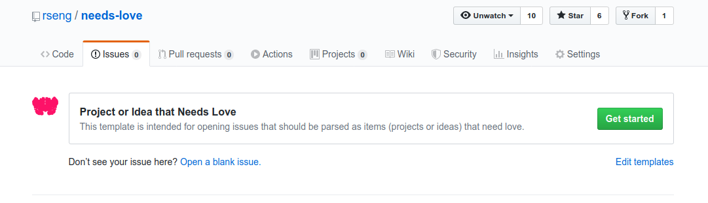
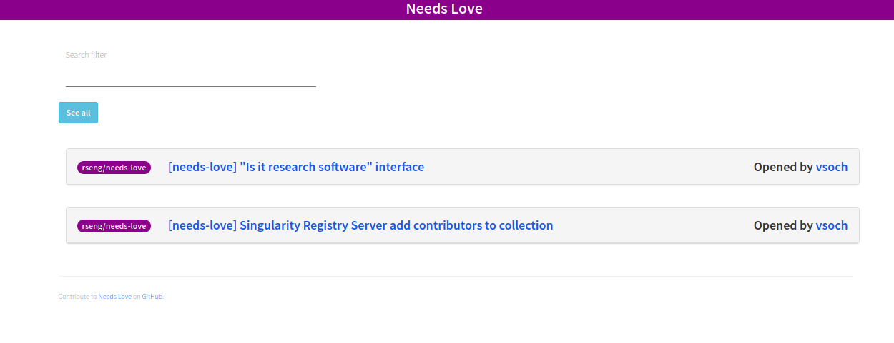

# Needs Love

  

## Background

This is an incubating project idea that will match research software engineers
with projects. It's a peer-to-peer network for learning by way of doing.
There are plenty of avenues for online learning, including tutorials, courses,
and documentation. However, sometimes the best way to learn is to have project
with one or more explicit goals to accomplish. This is the vision behind needs-love.

## What Needs Love?

You might feel overwhelmed or frustrated by a lack of time to finish
some of your projects, but have you ever thought about the opportunity
that such unfinished work offers?

For research software engineers that don't work in a group, or largely
exist in silos, finding consistent sources of challenge is a challenge
in and of itself. And guess what - an unfinished project and an RSE
hungry to learn is a match made in heaven. If you are submitting a project,
you get your project rolling again, and the RSE grows. 
It's a **peer to peer** network of matched mentorship that works really well 
for already very independent and curious engineers. 

In a nutshell, both the projects and the RSEs need a little love.

## Who is Involved?

### Starters

We aren't talking about bread, folks, but the pun is quite lovely. A starter
has put some time and thought into a recipe, and very likely started the baking
process, but doesn't have the bandwidth to finish the dough and put it in the oven.

#### What makes a good starter?

A good starter has expertise in some area, or a project started, but doesn't have time to finish up.
It's also okay to just have an idea that you want to throw out there for someone to work on.
You might not even know what the best implementation might be! Thus, a good starter
can also just have a good idea.

### Finishers

Finishers are hungry for opportunity, and fun projects. A finisher can be
very independent and curious, or ask for a bit more help. The finisher wants
to take some project that has been started, and turn it into delicious bread,
or an idea that isn't baked yet, and write the recipe.

#### What makes a good finisher?

The finisher, regardless of skill, should be motivated to take ownership of a project
or an idea.

### Submitting a Project or Idea

You can submit a project or idea that needs love simply by opening an issue, and selecting
the "Project or Idea that needs love" template.

 

Once your idea is submit, it will (each night) render to the interface of
projects that need love, which you can [see here](https://rseng.github.io/needs-love/).

### Matching Yourself

When you navigate the web interface to find an issue that looks interesting,
if you click the issue to navigate to the GitHub interface, you can have discussion
with the author about how you might like to be involved. 

#### What should you discuss?

The match between the starter, both project and individual, and the finisher,
is very important! While the criteria might vary by project, it's generally a good
idea to open up a discussion on one of the [needs-love](https://github.com/rseng/needs-love/issues?q=is%3Aissue+is%3Aopen+label%3Aneeds-love)
issues and discuss the following:

 - if expertise is known to be needed, where will it come from?
 - how can both parties best communicate, and ask questions?
 - what kind of time frame do you have in mind?
 - do you have all the resources that you need?

If there is match, great! You can match yourself simply by applying the `matched` label. A GitHub action
will handle removing the `needs-love` label so that others know that you've taken
charge. The interface will update over night.

### Updating a Match

If you can no longer work on a project or idea, you should notify the starter 
(the person that originally submit the issue) about this change, and he or she
can remove the `matched` label. Once this is done, a GitHub action will
add back the `needs-love` label so that others know that the issue is open to be
worked on.

## What if someone doesn't ask for help?

Asking for help can be hard! In some cases, asking for help can look like labeling
an issue with "Good First Issue." For this reason, for the interested folks that want to
persue a list of open source, research software engineering efforts, we provide the 
[awesome-rseng](https://github.com/rseng/awesome-rseng) awesome list.

## How can I contribute?

If you want to find a project to help with, you can browse the [issue board](https://github.com/rseng/needs-love/issues?q=is%3Aissue+is%3Aopen+label%3Aneeds-love) or the [interface here](https://rseng.github.io/needs-love/).
It's also very helpful to peruse around some of your projects, or open source projects
you contribute to, and look for good "needs love" issues. Many times, you can also have discussion
with colleagues to find what they are working on (and wish they had more time to work on).
