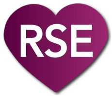

# Needs Love

## Background

This is an incubating project idea that will match research software engineers
with projects. It's a peer-to-peer network for learning by way of doing.

There are plenty of avenues for online learning, including tutorials, courses,
and documentation. However, sometimes the best way to learn is to have project
with one or more explicit goals to accomplish. This is the vision behind needs-love.

## What Needs Love?

You might feel overwhelmed or frustrated by a lack of time to finish
some of your projects, but have you ever thought about the opportunity
that such unfinished work offers?

For research software engineers that don't work in a group, or largely
exist in silos, finding consistent sources of challenge is a challenge
in and of itself. And guess what - an unfinished project and an RSE
hungry to learn is a match made in heaven. If you are submitting a project,
you get your project rolling again, and the RSE grows. 
It's a **peer to peer** network of matched mentorship that works really well 
for already very independent and curious engineers. 

In a nutshell, both the projects and the RSEs need a little love.

## Who is Involved?

### Starters

We aren't talking about bread, folks, but the pun is quite lovely. A starter
has put some time and thought into a recipe, and very likely started the baking
process, but doesn't have the bandwidth to finish the dough and put it in the oven.

#### What makes a good starter?

A good starter has expertise in some area, or a project started, but doesn't have time to finish up.

### Finishers

Finishers are hungry for opportunity, and fun projects. A finisher can be
very independent and curious, or ask for a bit more help. The finisher wants
to take some project that has been started, and turn it into delicious bread.

#### What makes a good finisher?

The finisher, regardless of skill, should be motivated to take ownership of a project.

### Matching

The match between the starter, both project and individual, and the finisher,
is very important. Namely:

 - the starter should have some expertise in the technology, or vision for it to interact with the finisher.
 - the finisher should have less knowledge or expertise about this particular technology, and the aim is to learn it.
 - the starter and finisher should be matched based on having these opposite levels of skill for some domain or technology.
 - an established method of asking questions and general communication should be established (e.g., GitHub issues).

It's clear that a good match can make or break a team. This is why the matching process is so important.

## How does it work?

These sections will include:

 - how to submit a project
 - how to request a match
 - how to update a match
 - perhaps guidelines for contributing, etc.

And more! I need to create templates, workflows, and think this through a bit more.

**to be written**
